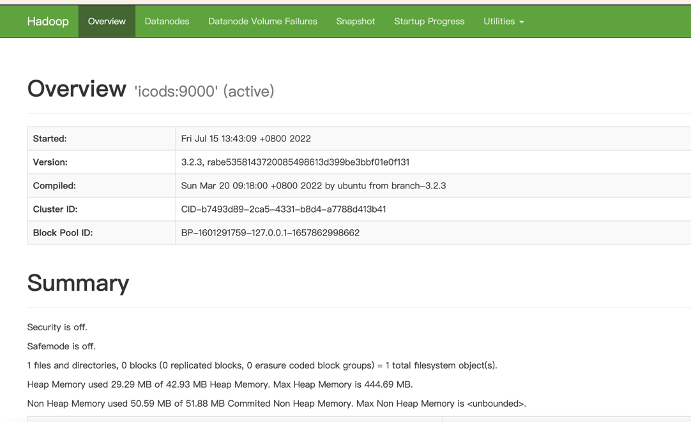
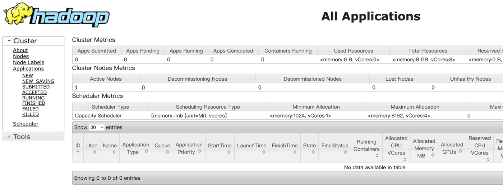

1.hadoop下载地址

https://hadoop.apache.org/release/3.2.3.html

https://mirrors.tuna.tsinghua.edu.cn/apache/


3.jdk下载地址

https://www.oracle.com/java/technologies/downloads/


4.下载后传输至服务器并解压

```shell
n@n:~/module$ tar -xzvf hadoop-3.2.3.tar.gz 
n@n:~/module$ tar -xzvf jdk-8u333-linux-x64.tar.gz
n@n:~/module$ mv jdk1.8.0_333/  jdk1.8
n@n:~/module$ pwd
/home/n/module
n@n:~/module$ ls -l
total 625256
drwxr-xr-x 9 n n      4096 Mar 20 09:58 hadoop-3.2.3
-rw-r--r-- 1 n n 492241961 Jul 13 14:59 hadoop-3.2.3.tar.gz
drwxr-xr-x 8 n n      4096 Apr 26 14:03 jdk1.8
-rw-r--r-- 1 n n 148003421 Jul 13 15:00 jdk-8u333-linux-x64.tar.gz
n@n:~/module$ 
```

5.添加环境变量

```shell
n@n:~$ vim .bash_profile #所有用户的环境变量 /etc/profile
n@n:~$ source .bash_profile 
n@n:~$ 
....
export JAVA_HOME=/home/n/module/jdk1.8
export PATH=.:$JAVA_HOME/bin:$PATH
...
n@n:~$ 
n@n:~$ java -version
java version "1.8.0_333"
Java(TM) SE Runtime Environment (build 1.8.0_333-b02)
Java HotSpot(TM) 64-Bit Server VM (build 25.333-b02, mixed mode)
n@n:~$ pwd
/home/n

```

6.修改etc/hadoop/hadoop-env.sh

```shell
n@n:~/module/hadoop-3.2.3$ mkdir logs
n@n:~/module/hadoop-3.2.3$ cd logs/
n@n:~/module/hadoop-3.2.3/logs$ ls
n@n:~/module/hadoop-3.2.3/logs$ pwd
/home/n/module/hadoop-3.2.3/logs
n@n:~/module/hadoop-3.2.3/logs$ 
n@n:~/module/hadoop-3.2.3/logs$ vim ../etc/hadoop/hadoop-env.sh 
##
export JAVA_HOME=/home/n/module/jdk1.8
export HADOOP_LOG_DIR=/home/n/module/hadoop-3.2.3/logs 
##
```

7.切换hostname 并设置免密ssh

```shell
[sudo] password for n: 
n@n:~$ 
n@n:~$ 
n@n:~$ 
n@n:~$ 
n@n:~$ 
n@n:~$ exit
n@n:~$ sudo hostname icods
exit

n@icods:~$ 
n@icods:~$ vim /etc/hosts
n@icods:~$ sudo vim  /etc/hosts
127.0.0.1 icods
n@icods:~$ 
n@icods:~$ 
n@icods:~$ ssh icods
The authenticity of host 'icods (127.0.0.1)' can't be established.
ECDSA key fingerprint is SHA256:zVAmXUENt/satRvRkfL9z4PRbIpTvBoQ3ZJxuAJEdw8.
Are you sure you want to continue connecting (yes/no)? yes
Warning: Permanently added 'icods' (ECDSA) to the list of known hosts.
n@icods's password: 
Welcome to Ubuntu 18.04.4 LTS (GNU/Linux 4.15.0-159-generic x86_64)

 * Documentation:  https://help.ubuntu.com
 * Management:     https://landscape.canonical.com
 * Support:        https://ubuntu.com/advantage

 System information disabled due to load higher than 1.0

 * Super-optimized for small spaces - read how we shrank the memory
   footprint of MicroK8s to make it the smallest full K8s around.

   https://ubuntu.com/blog/microk8s-memory-optimisation

 * Canonical Livepatch is available for installation.
   - Reduce system reboots and improve kernel security. Activate at:
     https://ubuntu.com/livepatch
New release '20.04.4 LTS' available.
Run 'do-release-upgrade' to upgrade to it.


Last login: Fri Jul 15 12:57:04 2022 from 219.142.240.74
n@icods:~$ 
n@icods:~$ exit
logout
Connection to icods closed.
n@icods:~$ 
n@icods:~$ 
n@icods:~$  ssh-keygen -t rsa
Generating public/private rsa key pair.
Enter file in which to save the key (/home/n/.ssh/id_rsa): 
Enter passphrase (empty for no passphrase): 
Enter same passphrase again: 
Your identification has been saved in /home/n/.ssh/id_rsa.
Your public key has been saved in /home/n/.ssh/id_rsa.pub.
The key fingerprint is:
SHA256:1ON7DB3zA84Ama8fBqK8CFVMSSXXedBBT6f/uQddLJM n@icods.cn
The key's randomart image is:
+---[RSA 2048]----+
|   ++oo.oBo.. .  |
|    +o  =ooo o   |
|   .    .o+ *  o |
|  .   .....* *E o|
| . . . .Soo + ++.|
|.   o   . o+  .oo|
| . . .   o..o  o.|
|  . .     ..    o|
|               ..|
+----[SHA256]-----+
n@icods:~$ 
n@icods:~$ ls -l ~/.ssh/
total 12
-rw------- 1 n n 1679 Jul 15 13:10 id_rsa
-rw-r--r-- 1 n n  392 Jul 15 13:10 id_rsa.pub
-rw-r--r-- 1 n n  222 Jul 15 13:07 known_hosts
n@icods:~$ 
n@icods:~$ cat ~/.ssh/id_rsa.pub >> ~/.ssh/authorized_keys
n@icods:~$ 
n@icods:~$ ssh icods
Welcome to Ubuntu 18.04.4 LTS (GNU/Linux 4.15.0-159-generic x86_64)

 * Documentation:  https://help.ubuntu.com
 * Management:     https://landscape.canonical.com
 * Support:        https://ubuntu.com/advantage

 System information disabled due to load higher than 1.0

 * Super-optimized for small spaces - read how we shrank the memory
   footprint of MicroK8s to make it the smallest full K8s around.

   https://ubuntu.com/blog/microk8s-memory-optimisation

 * Canonical Livepatch is available for installation.
   - Reduce system reboots and improve kernel security. Activate at:
     https://ubuntu.com/livepatch
New release '20.04.4 LTS' available.
Run 'do-release-upgrade' to upgrade to it.


Last login: Fri Jul 15 13:08:10 2022 from 127.0.0.1
n@icods:~$ 
```

8.修改

```shell
n@icods:~$ cd module/hadoop-3.2.3
n@icods:~/module/hadoop-3.2.3$ mkdir hadoop_repo
n@icods:~/module/hadoop-3.2.3$ 
n@icods:~/module/hadoop-3.2.3$ vim etc/hadoop/core-site.xml 
<configuration>
 <property>
 <name>fs.defaultFS</name>
 <value>hdfs://icods:9000</value>
 </property>
 <property>
 <name>hadoop.tmp.dir</name>
 <value>/home/n/module/hadoop-3.2.3/hadoop_repo</value>
 </property>
</configuration>

```

9.修改hdfs-site.xml文件，把hdfs中文件副本的数量设置为1，因为现在伪分布集群只有一个节点

```
n@icods:~/module/hadoop-3.2.3$ vi etc/hadoop/hdfs-site.xml 
<configuration>
 <property>
 <name>dfs.replication</name>
 <value>1</value>
 </property>
</configuration>                  
```

10.修改mapred-site.xml，设置mapreduce使用的资源调度框架

```
n@icods:~/module/hadoop-3.2.3$ vim etc/hadoop/mapred-site.xml 
<configuration>
<property>
 <name>mapreduce.framework.name</name>
 <value>yarn</value>
 </property>
</configuration>
```

11.修改yarn-site.xml，设置yarn上支持运行的服务和环境变量白名单

```shell
n@icods:~/module/hadoop-3.2.3$ vim etc/hadoop/yarn-site.xml 
<configuration>
<property>
        <name>yarn.nodemanager.aux-services</name>
        <value>mapreduce_shuffle</value>
</property>
<property>
        <name>yarn.nodemanager.env-whitelist</name>
        <value>JAVA_HOME,HADOOP_COMMON_HOME,HADOOP_HDFS_HOME,HADOOP_CONF_DIR,CLASSPATH_PREPEND_DISTCACHE,HADOOP_YARN_HOME,HADOOP_MAPRED_HOME</value>
</property>
<!-- Site specific YARN configuration properties -->

</configuration>
```

12.设置集群中从节点的主机名信息，在这里就一台集群，所以就填写icods即可

```
n@icods:~/module/hadoop-3.2.3$ vim etc/hadoop/workers 
icods
```

13.格式化HDFS

到这就修改好了，但是还不能直接启动，因为Hadoop中的HDFS是一个分布式的文件系统，文

件系统在使用之前是需要先格式化的，就类似我们买一块新的磁盘，在安装系统之前需要先格式化才可以

使用。

如果确实需要重复执行，那么需要把/data/hadoop_repo目录中的内容删除

格式化操作只能执行一次，如果格式化的时候失败了，可以修改配置文件后再执行格式

化，如果格式化成功了就不能再重复执行了，否则集群就会出现问题。


```shell
n@icods:~/module/hadoop-3.2.3$ bin/hdfs namenode -format
2022-07-15 13:29:56,837 INFO namenode.NameNode: STARTUP_MSG: 
/************************************************************
STARTUP_MSG: Starting NameNode
STARTUP_MSG:   host = localhost/127.0.0.1
STARTUP_MSG:   args = [-format]
STARTUP_MSG:   version = 3.2.3
STARTUP_MSG:   classpath = /home/n/module/hadoop-3.2.3/etc/hadoop:/home/n/module/hadoop-3.2.3/share/hadoop/common/lib/kerb-core-1.0.1.jar:/home/n/module/hadoop-3.2.3/share/hadoop/common/lib/jackson-core-2.10.5.jar:/home/n/module/hadoop-3.2.3/share/hadoop/common/lib/commons-math3-3.1.1.jar:/home/n/module/hadoop-3.2.3/share/hadoop/common/lib/woodstox-core-5.3.0.jar:/home/n/module/hadoop-3.2.3/share/hadoop/common/lib/listenablefuture-9999.0-empty-to-avoid-conflict-with-guava.jar:/home/n/module/hadoop-3.2.3/share/hadoop/common/lib/jetty-security-9.4.40.v20210413.jar:/home/n/module/hadoop-3.2.3/share/hadoop/common/lib/audience-annotations-0.5.0.jar:/home/n/module/hadoop-3.2.3/share/hadoop/common/lib/commons-io-2.8.0.jar:/home/n/module/hadoop-3.2.3/share/hadoop/common/lib/jersey-server-1.19.jar:/home/n/module/hadoop-3.2.3/share/hadoop/common/lib/json-smart-2.4.7.jar:/home/n/module/hadoop-3.2.3/share/hadoop/common/lib/httpclient-4.5.13.jar:/home/n/module/hadoop-3.2.3/share/hadoop/common/lib/error_prone_annotations-2.2.0.jar:/home/n/module/hadoop-3.2.3/share/hadoop/common/lib/kerby-util-1.0.1.jar:/home/n/module/hadoop-3.2.3/share/hadoop/common/lib/avro-1.7.7.jar:/home/n/module/hadoop-3.2.3/share/hadoop/common/lib/commons-net-3.6.jar:/home/n/module/hadoop-3.2.3/share/hadoop/common/lib/paranamer-2.3.jar:/home/n/module/hadoop-3.2.3/share/hadoop/common/lib/commons-codec-1.11.jar:/home/n/module/hadoop-3.2.3/share/hadoop/common/lib/commons-collections-3.2.2.jar:/home/n/module/hadoop-3.2.3/share/hadoop/common/lib/gson-2.2.4.jar:/home/n/module/hadoop-3.2.3/share/hadoop/common/lib/jaxb-impl-2.2.3-1.jar:/home/n/module/hadoop-3.2.3/share/hadoop/common/lib/jettison-1.1.jar:/home/n/module/hadoop-3.2.3/share/hadoop/common/lib/commons-logging-1.1.3.jar:/home/n/module/hadoop-3.2.3/share/hadoop/common/lib/slf4j-log4j12-1.7.25.jar:/home/n/module/hadoop-3.2.3/share/hadoop/common/lib/kerb-client-1.0.1.jar:/home/n/module/hadoop-3.2.3/share/hadoop/common/lib/slf4j-api-1.7.25.jar:/home/n/module/hadoop-3.2.3/share/hadoop/common/lib/jcip-annotations-1.0-1.jar:/home/n/module/hadoop-3.2.3/share/hadoop/common/lib/hadoop-auth-3.2.3.jar:/home/n/module/hadoop-3.2.3/share/hadoop/common/lib/kerby-xdr-1.0.1.jar:/home/n/module/hadoop-3.2.3/share/hadoop/common/lib/commons-text-1.4.jar:/home/n/module/hadoop-3.2.3/share/hadoop/common/lib/dnsjava-2.1.7.jar:/home/n/module/hadoop-3.2.3/share/hadoop/common/lib/jackson-xc-1.9.13.jar:/home/n/module/hadoop-3.2.3/share/hadoop/common/lib/stax2-api-4.2.1.jar:/home/n/module/hadoop-3.2.3/share/hadoop/common/lib/commons-lang3-3.7.jar:/home/n/module/hadoop-3.2.3/share/hadoop/common/lib/hadoop-annotations-3.2.3.jar:/home/n/module/hadoop-3.2.3/share/hadoop/common/lib/guava-27.0-jre.jar:/home/n/module/hadoop-3.2.3/share/hadoop/common/lib/nimbus-jose-jwt-9.8.1.jar:/home/n/module/hadoop-3.2.3/share/hadoop/common/lib/metrics-core-3.2.4.jar:/home/n/module/hadoop-3.2.3/share/hadoop/common/lib/animal-sniffer-annotations-1.17.jar:/home/n/module/hadoop-3.2.3/share/hadoop/common/lib/kerb-util-1.0.1.jar:/home/n/module/hadoop-3.2.3/share/hadoop/common/lib/curator-client-2.13.0.jar:/home/n/module/hadoop-3.2.3/share/hadoop/common/lib/kerb-simplekdc-1.0.1.jar:/home/n/module/hadoop-3.2.3/share/hadoop/common/lib/jsr311-api-1.1.1.jar:/home/n/module/hadoop-3.2.3/share/hadoop/common/lib/jetty-server-9.4.40.v20210413.jar:/home/n/module/hadoop-3.2.3/share/hadoop/common/lib/jetty-http-9.4.40.v20210413.jar:/home/n/module/hadoop-3.2.3/share/hadoop/common/lib/curator-recipes-2.13.0.jar:/home/n/module/hadoop-3.2.3/share/hadoop/common/lib/jsch-0.1.55.jar:/home/n/module/hadoop-3.2.3/share/hadoop/common/lib/kerb-crypto-1.0.1.jar:/home/n/module/hadoop-3.2.3/share/hadoop/common/lib/token-provider-1.0.1.jar:/home/n/module/hadoop-3.2.3/share/hadoop/common/lib/javax.servlet-api-3.1.0.jar:/home/n/module/hadoop-3.2.3/share/hadoop/common/lib/jersey-json-1.19.jar:/home/n/module/hadoop-3.2.3/share/hadoop/common/lib/jetty-servlet-9.4.40.v20210413.jar:/home/n/module/hadoop-3.2.3/share/hadoop/common/lib/kerby-pkix-1.0.1.jar:/home/n/module/hadoop-3.2.3/share/hadoop/common/lib/checker-qual-2.5.2.jar:/home/n/module/hadoop-3.2.3/share/hadoop/common/lib/kerb-identity-1.0.1.jar:/home/n/module/hadoop-3.2.3/share/hadoop/common/lib/jersey-core-1.19.jar:/home/n/module/hadoop-3.2.3/share/hadoop/common/lib/javax.activation-api-1.2.0.jar:/home/n/module/hadoop-3.2.3/share/hadoop/common/lib/re2j-1.1.jar:/home/n/module/hadoop-3.2.3/share/hadoop/common/lib/jetty-io-9.4.40.v20210413.jar:/home/n/module/hadoop-3.2.3/share/hadoop/common/lib/commons-compress-1.21.jar:/home/n/module/hadoop-3.2.3/share/hadoop/common/lib/jackson-annotations-2.10.5.jar:/home/n/module/hadoop-3.2.3/share/hadoop/common/lib/kerby-config-1.0.1.jar:/home/n/module/hadoop-3.2.3/share/hadoop/common/lib/jackson-jaxrs-1.9.13.jar:/home/n/module/hadoop-3.2.3/share/hadoop/common/lib/j2objc-annotations-1.1.jar:/home/n/module/hadoop-3.2.3/share/hadoop/common/lib/commons-configuration2-2.1.1.jar:/home/n/module/hadoop-3.2.3/share/hadoop/common/lib/commons-beanutils-1.9.4.jar:/home/n/module/hadoop-3.2.3/share/hadoop/common/lib/httpcore-4.4.13.jar:/home/n/module/hadoop-3.2.3/share/hadoop/common/lib/accessors-smart-2.4.7.jar:/home/n/module/hadoop-3.2.3/share/hadoop/common/lib/jackson-databind-2.10.5.1.jar:/home/n/module/hadoop-3.2.3/share/hadoop/common/lib/zookeeper-3.4.14.jar:/home/n/module/hadoop-3.2.3/share/hadoop/common/lib/jackson-core-asl-1.9.13.jar:/home/n/module/hadoop-3.2.3/share/hadoop/common/lib/asm-5.0.4.jar:/home/n/module/hadoop-3.2.3/share/hadoop/common/lib/kerby-asn1-1.0.1.jar:/home/n/module/hadoop-3.2.3/share/hadoop/common/lib/protobuf-java-2.5.0.jar:/home/n/module/hadoop-3.2.3/share/hadoop/common/lib/kerb-admin-1.0.1.jar:/home/n/module/hadoop-3.2.3/share/hadoop/common/lib/jetty-util-9.4.40.v20210413.jar:/home/n/module/hadoop-3.2.3/share/hadoop/common/lib/log4j-1.2.17.jar:/home/n/module/hadoop-3.2.3/share/hadoop/common/lib/jackson-mapper-asl-1.9.13.jar:/home/n/module/hadoop-3.2.3/share/hadoop/common/lib/snappy-java-1.0.5.jar:/home/n/module/hadoop-3.2.3/share/hadoop/common/lib/netty-3.10.6.Final.jar:/home/n/module/hadoop-3.2.3/share/hadoop/common/lib/kerb-common-1.0.1.jar:/home/n/module/hadoop-3.2.3/share/hadoop/common/lib/jsr305-3.0.2.jar:/home/n/module/hadoop-3.2.3/share/hadoop/common/lib/jaxb-api-2.2.11.jar:/home/n/module/hadoop-3.2.3/share/hadoop/common/lib/htrace-core4-4.1.0-incubating.jar:/home/n/module/hadoop-3.2.3/share/hadoop/common/lib/failureaccess-1.0.jar:/home/n/module/hadoop-3.2.3/share/hadoop/common/lib/jetty-webapp-9.4.40.v20210413.jar:/home/n/module/hadoop-3.2.3/share/hadoop/common/lib/jersey-servlet-1.19.jar:/home/n/module/hadoop-3.2.3/share/hadoop/common/lib/spotbugs-annotations-3.1.9.jar:/home/n/module/hadoop-3.2.3/share/hadoop/common/lib/commons-cli-1.2.jar:/home/n/module/hadoop-3.2.3/share/hadoop/common/lib/kerb-server-1.0.1.jar:/home/n/module/hadoop-3.2.3/share/hadoop/common/lib/jul-to-slf4j-1.7.25.jar:/home/n/module/hadoop-3.2.3/share/hadoop/common/lib/jetty-xml-9.4.40.v20210413.jar:/home/n/module/hadoop-3.2.3/share/hadoop/common/lib/curator-framework-2.13.0.jar:/home/n/module/hadoop-3.2.3/share/hadoop/common/lib/jsp-api-2.1.jar:/home/n/module/hadoop-3.2.3/share/hadoop/common/lib/jetty-util-ajax-9.4.40.v20210413.jar:/home/n/module/hadoop-3.2.3/share/hadoop/common/hadoop-kms-3.2.3.jar:/home/n/module/hadoop-3.2.3/share/hadoop/common/hadoop-common-3.2.3-tests.jar:/home/n/module/hadoop-3.2.3/share/hadoop/common/hadoop-nfs-3.2.3.jar:/home/n/module/hadoop-3.2.3/share/hadoop/common/hadoop-common-3.2.3.jar:/home/n/module/hadoop-3.2.3/share/hadoop/hdfs:/home/n/module/hadoop-3.2.3/share/hadoop/hdfs/lib/kerb-core-1.0.1.jar:/home/n/module/hadoop-3.2.3/share/hadoop/hdfs/lib/jackson-core-2.10.5.jar:/home/n/module/hadoop-3.2.3/share/hadoop/hdfs/lib/commons-math3-3.1.1.jar:/home/n/module/hadoop-3.2.3/share/hadoop/hdfs/lib/woodstox-core-5.3.0.jar:/home/n/module/hadoop-3.2.3/share/hadoop/hdfs/lib/listenablefuture-9999.0-empty-to-avoid-conflict-with-guava.jar:/home/n/module/hadoop-3.2.3/share/hadoop/hdfs/lib/jetty-security-9.4.40.v20210413.jar:/home/n/module/hadoop-3.2.3/share/hadoop/hdfs/lib/audience-annotations-0.5.0.jar:/home/n/module/hadoop-3.2.3/share/hadoop/hdfs/lib/commons-io-2.8.0.jar:/home/n/module/hadoop-3.2.3/share/hadoop/hdfs/lib/jersey-server-1.19.jar:/home/n/module/hadoop-3.2.3/share/hadoop/hdfs/lib/json-smart-2.4.7.jar:/home/n/module/hadoop-3.2.3/share/hadoop/hdfs/lib/httpclient-4.5.13.jar:/home/n/module/hadoop-3.2.3/share/hadoop/hdfs/lib/error_prone_annotations-2.2.0.jar:/home/n/module/hadoop-3.2.3/share/hadoop/hdfs/lib/kerby-util-1.0.1.jar:/home/n/module/hadoop-3.2.3/share/hadoop/hdfs/lib/okio-1.6.0.jar:/home/n/module/hadoop-3.2.3/share/hadoop/hdfs/lib/avro-1.7.7.jar:/home/n/module/hadoop-3.2.3/share/hadoop/hdfs/lib/commons-net-3.6.jar:/home/n/module/hadoop-3.2.3/share/hadoop/hdfs/lib/paranamer-2.3.jar:/home/n/module/hadoop-3.2.3/share/hadoop/hdfs/lib/commons-codec-1.11.jar:/home/n/module/hadoop-3.2.3/share/hadoop/hdfs/lib/commons-collections-3.2.2.jar:/home/n/module/hadoop-3.2.3/share/hadoop/hdfs/lib/gson-2.2.4.jar:/home/n/module/hadoop-3.2.3/share/hadoop/hdfs/lib/jaxb-impl-2.2.3-1.jar:/home/n/module/hadoop-3.2.3/share/hadoop/hdfs/lib/jettison-1.1.jar:/home/n/module/hadoop-3.2.3/share/hadoop/hdfs/lib/commons-logging-1.1.3.jar:/home/n/module/hadoop-3.2.3/share/hadoop/hdfs/lib/kerb-client-1.0.1.jar:/home/n/module/hadoop-3.2.3/share/hadoop/hdfs/lib/jcip-annotations-1.0-1.jar:/home/n/module/hadoop-3.2.3/share/hadoop/hdfs/lib/leveldbjni-all-1.8.jar:/home/n/module/hadoop-3.2.3/share/hadoop/hdfs/lib/hadoop-auth-3.2.3.jar:/home/n/module/hadoop-3.2.3/share/hadoop/hdfs/lib/json-simple-1.1.1.jar:/home/n/module/hadoop-3.2.3/share/hadoop/hdfs/lib/kerby-xdr-1.0.1.jar:/home/n/module/hadoop-3.2.3/share/hadoop/hdfs/lib/commons-text-1.4.jar:/home/n/module/hadoop-3.2.3/share/hadoop/hdfs/lib/dnsjava-2.1.7.jar:/home/n/module/hadoop-3.2.3/share/hadoop/hdfs/lib/jackson-xc-1.9.13.jar:/home/n/module/hadoop-3.2.3/share/hadoop/hdfs/lib/stax2-api-4.2.1.jar:/home/n/module/hadoop-3.2.3/share/hadoop/hdfs/lib/commons-lang3-3.7.jar:/home/n/module/hadoop-3.2.3/share/hadoop/hdfs/lib/hadoop-annotations-3.2.3.jar:/home/n/module/hadoop-3.2.3/share/hadoop/hdfs/lib/guava-27.0-jre.jar:/home/n/module/hadoop-3.2.3/share/hadoop/hdfs/lib/nimbus-jose-jwt-9.8.1.jar:/home/n/module/hadoop-3.2.3/share/hadoop/hdfs/lib/animal-sniffer-annotations-1.17.jar:/home/n/module/hadoop-3.2.3/share/hadoop/hdfs/lib/kerb-util-1.0.1.jar:/home/n/module/hadoop-3.2.3/share/hadoop/hdfs/lib/curator-client-2.13.0.jar:/home/n/module/hadoop-3.2.3/share/hadoop/hdfs/lib/kerb-simplekdc-1.0.1.jar:/home/n/module/hadoop-3.2.3/share/hadoop/hdfs/lib/jsr311-api-1.1.1.jar:/home/n/module/hadoop-3.2.3/share/hadoop/hdfs/lib/jetty-server-9.4.40.v20210413.jar:/home/n/module/hadoop-3.2.3/share/hadoop/hdfs/lib/jetty-http-9.4.40.v20210413.jar:/home/n/module/hadoop-3.2.3/share/hadoop/hdfs/lib/curator-recipes-2.13.0.jar:/home/n/module/hadoop-3.2.3/share/hadoop/hdfs/lib/jsch-0.1.55.jar:/home/n/module/hadoop-3.2.3/share/hadoop/hdfs/lib/kerb-crypto-1.0.1.jar:/home/n/module/hadoop-3.2.3/share/hadoop/hdfs/lib/token-provider-1.0.1.jar:/home/n/module/hadoop-3.2.3/share/hadoop/hdfs/lib/javax.servlet-api-3.1.0.jar:/home/n/module/hadoop-3.2.3/share/hadoop/hdfs/lib/jersey-json-1.19.jar:/home/n/module/hadoop-3.2.3/share/hadoop/hdfs/lib/jetty-servlet-9.4.40.v20210413.jar:/home/n/module/hadoop-3.2.3/share/hadoop/hdfs/lib/commons-daemon-1.0.13.jar:/home/n/module/hadoop-3.2.3/share/hadoop/hdfs/lib/kerby-pkix-1.0.1.jar:/home/n/module/hadoop-3.2.3/share/hadoop/hdfs/lib/checker-qual-2.5.2.jar:/home/n/module/hadoop-3.2.3/share/hadoop/hdfs/lib/kerb-identity-1.0.1.jar:/home/n/module/hadoop-3.2.3/share/hadoop/hdfs/lib/jersey-core-1.19.jar:/home/n/module/hadoop-3.2.3/share/hadoop/hdfs/lib/javax.activation-api-1.2.0.jar:/home/n/module/hadoop-3.2.3/share/hadoop/hdfs/lib/re2j-1.1.jar:/home/n/module/hadoop-3.2.3/share/hadoop/hdfs/lib/jetty-io-9.4.40.v20210413.jar:/home/n/module/hadoop-3.2.3/share/hadoop/hdfs/lib/commons-compress-1.21.jar:/home/n/module/hadoop-3.2.3/share/hadoop/hdfs/lib/jackson-annotations-2.10.5.jar:/home/n/module/hadoop-3.2.3/share/hadoop/hdfs/lib/kerby-config-1.0.1.jar:/home/n/module/hadoop-3.2.3/share/hadoop/hdfs/lib/jackson-jaxrs-1.9.13.jar:/home/n/module/hadoop-3.2.3/share/hadoop/hdfs/lib/j2objc-annotations-1.1.jar:/home/n/module/hadoop-3.2.3/share/hadoop/hdfs/lib/commons-configuration2-2.1.1.jar:/home/n/module/hadoop-3.2.3/share/hadoop/hdfs/lib/commons-beanutils-1.9.4.jar:/home/n/module/hadoop-3.2.3/share/hadoop/hdfs/lib/httpcore-4.4.13.jar:/home/n/module/hadoop-3.2.3/share/hadoop/hdfs/lib/accessors-smart-2.4.7.jar:/home/n/module/hadoop-3.2.3/share/hadoop/hdfs/lib/jackson-databind-2.10.5.1.jar:/home/n/module/hadoop-3.2.3/share/hadoop/hdfs/lib/zookeeper-3.4.14.jar:/home/n/module/hadoop-3.2.3/share/hadoop/hdfs/lib/jackson-core-asl-1.9.13.jar:/home/n/module/hadoop-3.2.3/share/hadoop/hdfs/lib/okhttp-2.7.5.jar:/home/n/module/hadoop-3.2.3/share/hadoop/hdfs/lib/asm-5.0.4.jar:/home/n/module/hadoop-3.2.3/share/hadoop/hdfs/lib/kerby-asn1-1.0.1.jar:/home/n/module/hadoop-3.2.3/share/hadoop/hdfs/lib/protobuf-java-2.5.0.jar:/home/n/module/hadoop-3.2.3/share/hadoop/hdfs/lib/kerb-admin-1.0.1.jar:/home/n/module/hadoop-3.2.3/share/hadoop/hdfs/lib/jetty-util-9.4.40.v20210413.jar:/home/n/module/hadoop-3.2.3/share/hadoop/hdfs/lib/log4j-1.2.17.jar:/home/n/module/hadoop-3.2.3/share/hadoop/hdfs/lib/jackson-mapper-asl-1.9.13.jar:/home/n/module/hadoop-3.2.3/share/hadoop/hdfs/lib/snappy-java-1.0.5.jar:/home/n/module/hadoop-3.2.3/share/hadoop/hdfs/lib/netty-3.10.6.Final.jar:/home/n/module/hadoop-3.2.3/share/hadoop/hdfs/lib/kerb-common-1.0.1.jar:/home/n/module/hadoop-3.2.3/share/hadoop/hdfs/lib/netty-all-4.1.68.Final.jar:/home/n/module/hadoop-3.2.3/share/hadoop/hdfs/lib/jsr305-3.0.2.jar:/home/n/module/hadoop-3.2.3/share/hadoop/hdfs/lib/jaxb-api-2.2.11.jar:/home/n/module/hadoop-3.2.3/share/hadoop/hdfs/lib/htrace-core4-4.1.0-incubating.jar:/home/n/module/hadoop-3.2.3/share/hadoop/hdfs/lib/failureaccess-1.0.jar:/home/n/module/hadoop-3.2.3/share/hadoop/hdfs/lib/jetty-webapp-9.4.40.v20210413.jar:/home/n/module/hadoop-3.2.3/share/hadoop/hdfs/lib/jersey-servlet-1.19.jar:/home/n/module/hadoop-3.2.3/share/hadoop/hdfs/lib/spotbugs-annotations-3.1.9.jar:/home/n/module/hadoop-3.2.3/share/hadoop/hdfs/lib/commons-cli-1.2.jar:/home/n/module/hadoop-3.2.3/share/hadoop/hdfs/lib/kerb-server-1.0.1.jar:/home/n/module/hadoop-3.2.3/share/hadoop/hdfs/lib/jetty-xml-9.4.40.v20210413.jar:/home/n/module/hadoop-3.2.3/share/hadoop/hdfs/lib/curator-framework-2.13.0.jar:/home/n/module/hadoop-3.2.3/share/hadoop/hdfs/lib/jetty-util-ajax-9.4.40.v20210413.jar:/home/n/module/hadoop-3.2.3/share/hadoop/hdfs/hadoop-hdfs-3.2.3-tests.jar:/home/n/module/hadoop-3.2.3/share/hadoop/hdfs/hadoop-hdfs-3.2.3.jar:/home/n/module/hadoop-3.2.3/share/hadoop/hdfs/hadoop-hdfs-rbf-3.2.3-tests.jar:/home/n/module/hadoop-3.2.3/share/hadoop/hdfs/hadoop-hdfs-native-client-3.2.3-tests.jar:/home/n/module/hadoop-3.2.3/share/hadoop/hdfs/hadoop-hdfs-client-3.2.3.jar:/home/n/module/hadoop-3.2.3/share/hadoop/hdfs/hadoop-hdfs-client-3.2.3-tests.jar:/home/n/module/hadoop-3.2.3/share/hadoop/hdfs/hadoop-hdfs-httpfs-3.2.3.jar:/home/n/module/hadoop-3.2.3/share/hadoop/hdfs/hadoop-hdfs-nfs-3.2.3.jar:/home/n/module/hadoop-3.2.3/share/hadoop/hdfs/hadoop-hdfs-rbf-3.2.3.jar:/home/n/module/hadoop-3.2.3/share/hadoop/hdfs/hadoop-hdfs-native-client-3.2.3.jar:/home/n/module/hadoop-3.2.3/share/hadoop/mapreduce/lib/hamcrest-core-1.3.jar:/home/n/module/hadoop-3.2.3/share/hadoop/mapreduce/lib/junit-4.13.2.jar:/home/n/module/hadoop-3.2.3/share/hadoop/mapreduce/hadoop-mapreduce-client-hs-3.2.3.jar:/home/n/module/hadoop-3.2.3/share/hadoop/mapreduce/hadoop-mapreduce-client-uploader-3.2.3.jar:/home/n/module/hadoop-3.2.3/share/hadoop/mapreduce/hadoop-mapreduce-client-jobclient-3.2.3-tests.jar:/home/n/module/hadoop-3.2.3/share/hadoop/mapreduce/hadoop-mapreduce-client-shuffle-3.2.3.jar:/home/n/module/hadoop-3.2.3/share/hadoop/mapreduce/hadoop-mapreduce-examples-3.2.3.jar:/home/n/module/hadoop-3.2.3/share/hadoop/mapreduce/hadoop-mapreduce-client-hs-plugins-3.2.3.jar:/home/n/module/hadoop-3.2.3/share/hadoop/mapreduce/hadoop-mapreduce-client-nativetask-3.2.3.jar:/home/n/module/hadoop-3.2.3/share/hadoop/mapreduce/hadoop-mapreduce-client-common-3.2.3.jar:/home/n/module/hadoop-3.2.3/share/hadoop/mapreduce/hadoop-mapreduce-client-app-3.2.3.jar:/home/n/module/hadoop-3.2.3/share/hadoop/mapreduce/hadoop-mapreduce-client-jobclient-3.2.3.jar:/home/n/module/hadoop-3.2.3/share/hadoop/mapreduce/hadoop-mapreduce-client-core-3.2.3.jar:/home/n/module/hadoop-3.2.3/share/hadoop/yarn:/home/n/module/hadoop-3.2.3/share/hadoop/yarn/lib/jakarta.xml.bind-api-2.3.2.jar:/home/n/module/hadoop-3.2.3/share/hadoop/yarn/lib/javax.inject-1.jar:/home/n/module/hadoop-3.2.3/share/hadoop/yarn/lib/guice-servlet-4.0.jar:/home/n/module/hadoop-3.2.3/share/hadoop/yarn/lib/geronimo-jcache_1.0_spec-1.0-alpha-1.jar:/home/n/module/hadoop-3.2.3/share/hadoop/yarn/lib/fst-2.50.jar:/home/n/module/hadoop-3.2.3/share/hadoop/yarn/lib/jackson-jaxrs-json-provider-2.10.5.jar:/home/n/module/hadoop-3.2.3/share/hadoop/yarn/lib/snakeyaml-1.26.jar:/home/n/module/hadoop-3.2.3/share/hadoop/yarn/lib/metrics-core-3.2.4.jar:/home/n/module/hadoop-3.2.3/share/hadoop/yarn/lib/jackson-jaxrs-base-2.10.5.jar:/home/n/module/hadoop-3.2.3/share/hadoop/yarn/lib/ehcache-3.3.1.jar:/home/n/module/hadoop-3.2.3/share/hadoop/yarn/lib/guice-4.0.jar:/home/n/module/hadoop-3.2.3/share/hadoop/yarn/lib/bcpkix-jdk15on-1.60.jar:/home/n/module/hadoop-3.2.3/share/hadoop/yarn/lib/mssql-jdbc-6.2.1.jre7.jar:/home/n/module/hadoop-3.2.3/share/hadoop/yarn/lib/jersey-guice-1.19.jar:/home/n/module/hadoop-3.2.3/share/hadoop/yarn/lib/bcprov-jdk15on-1.60.jar:/home/n/module/hadoop-3.2.3/share/hadoop/yarn/lib/jakarta.activation-api-1.2.1.jar:/home/n/module/hadoop-3.2.3/share/hadoop/yarn/lib/aopalliance-1.0.jar:/home/n/module/hadoop-3.2.3/share/hadoop/yarn/lib/swagger-annotations-1.5.4.jar:/home/n/module/hadoop-3.2.3/share/hadoop/yarn/lib/objenesis-1.0.jar:/home/n/module/hadoop-3.2.3/share/hadoop/yarn/lib/HikariCP-java7-2.4.12.jar:/home/n/module/hadoop-3.2.3/share/hadoop/yarn/lib/jersey-client-1.19.jar:/home/n/module/hadoop-3.2.3/share/hadoop/yarn/lib/jackson-module-jaxb-annotations-2.10.5.jar:/home/n/module/hadoop-3.2.3/share/hadoop/yarn/lib/java-util-1.9.0.jar:/home/n/module/hadoop-3.2.3/share/hadoop/yarn/lib/json-io-2.5.1.jar:/home/n/module/hadoop-3.2.3/share/hadoop/yarn/hadoop-yarn-client-3.2.3.jar:/home/n/module/hadoop-3.2.3/share/hadoop/yarn/hadoop-yarn-server-sharedcachemanager-3.2.3.jar:/home/n/module/hadoop-3.2.3/share/hadoop/yarn/hadoop-yarn-services-core-3.2.3.jar:/home/n/module/hadoop-3.2.3/share/hadoop/yarn/hadoop-yarn-registry-3.2.3.jar:/home/n/module/hadoop-3.2.3/share/hadoop/yarn/hadoop-yarn-server-router-3.2.3.jar:/home/n/module/hadoop-3.2.3/share/hadoop/yarn/hadoop-yarn-common-3.2.3.jar:/home/n/module/hadoop-3.2.3/share/hadoop/yarn/hadoop-yarn-services-api-3.2.3.jar:/home/n/module/hadoop-3.2.3/share/hadoop/yarn/hadoop-yarn-applications-unmanaged-am-launcher-3.2.3.jar:/home/n/module/hadoop-3.2.3/share/hadoop/yarn/hadoop-yarn-server-timeline-pluginstorage-3.2.3.jar:/home/n/module/hadoop-3.2.3/share/hadoop/yarn/hadoop-yarn-server-web-proxy-3.2.3.jar:/home/n/module/hadoop-3.2.3/share/hadoop/yarn/hadoop-yarn-api-3.2.3.jar:/home/n/module/hadoop-3.2.3/share/hadoop/yarn/hadoop-yarn-server-resourcemanager-3.2.3.jar:/home/n/module/hadoop-3.2.3/share/hadoop/yarn/hadoop-yarn-server-nodemanager-3.2.3.jar:/home/n/module/hadoop-3.2.3/share/hadoop/yarn/hadoop-yarn-submarine-3.2.3.jar:/home/n/module/hadoop-3.2.3/share/hadoop/yarn/hadoop-yarn-server-applicationhistoryservice-3.2.3.jar:/home/n/module/hadoop-3.2.3/share/hadoop/yarn/hadoop-yarn-server-common-3.2.3.jar:/home/n/module/hadoop-3.2.3/share/hadoop/yarn/hadoop-yarn-applications-distributedshell-3.2.3.jar:/home/n/module/hadoop-3.2.3/share/hadoop/yarn/hadoop-yarn-server-tests-3.2.3.jar
STARTUP_MSG:   build = https://github.com/apache/hadoop -r abe5358143720085498613d399be3bbf01e0f131; compiled by 'ubuntu' on 2022-03-20T01:18Z
STARTUP_MSG:   java = 1.8.0_333
************************************************************/
2022-07-15 13:29:56,855 INFO namenode.NameNode: registered UNIX signal handlers for [TERM, HUP, INT]
2022-07-15 13:29:57,033 INFO namenode.NameNode: createNameNode [-format]
Formatting using clusterid: CID-b7493d89-2ca5-4331-b8d4-a7788d413b41
2022-07-15 13:29:58,239 INFO namenode.FSEditLog: Edit logging is async:true
2022-07-15 13:29:58,304 INFO namenode.FSNamesystem: KeyProvider: null
2022-07-15 13:29:58,306 INFO namenode.FSNamesystem: fsLock is fair: true
2022-07-15 13:29:58,306 INFO namenode.FSNamesystem: Detailed lock hold time metrics enabled: false
2022-07-15 13:29:58,319 INFO namenode.FSNamesystem: fsOwner             = n (auth:SIMPLE)
2022-07-15 13:29:58,320 INFO namenode.FSNamesystem: supergroup          = supergroup
2022-07-15 13:29:58,320 INFO namenode.FSNamesystem: isPermissionEnabled = true
2022-07-15 13:29:58,320 INFO namenode.FSNamesystem: HA Enabled: false
2022-07-15 13:29:58,403 INFO common.Util: dfs.datanode.fileio.profiling.sampling.percentage set to 0. Disabling file IO profiling
2022-07-15 13:29:58,419 INFO blockmanagement.DatanodeManager: dfs.block.invalidate.limit: configured=1000, counted=60, effected=1000
2022-07-15 13:29:58,419 INFO blockmanagement.DatanodeManager: dfs.namenode.datanode.registration.ip-hostname-check=true
2022-07-15 13:29:58,429 INFO blockmanagement.BlockManager: dfs.namenode.startup.delay.block.deletion.sec is set to 000:00:00:00.000
2022-07-15 13:29:58,431 INFO blockmanagement.BlockManager: The block deletion will start around 2022 Jul 15 13:29:58
2022-07-15 13:29:58,433 INFO util.GSet: Computing capacity for map BlocksMap
2022-07-15 13:29:58,433 INFO util.GSet: VM type       = 64-bit
2022-07-15 13:29:58,434 INFO util.GSet: 2.0% max memory 444.7 MB = 8.9 MB
2022-07-15 13:29:58,434 INFO util.GSet: capacity      = 2^20 = 1048576 entries
2022-07-15 13:29:58,445 INFO blockmanagement.BlockManager: Storage policy satisfier is disabled
2022-07-15 13:29:58,445 INFO blockmanagement.BlockManager: dfs.block.access.token.enable = false
2022-07-15 13:29:58,452 INFO blockmanagement.BlockManagerSafeMode: dfs.namenode.safemode.threshold-pct = 0.9990000128746033
2022-07-15 13:29:58,452 INFO blockmanagement.BlockManagerSafeMode: dfs.namenode.safemode.min.datanodes = 0
2022-07-15 13:29:58,452 INFO blockmanagement.BlockManagerSafeMode: dfs.namenode.safemode.extension = 30000
2022-07-15 13:29:58,453 INFO blockmanagement.BlockManager: defaultReplication         = 1
2022-07-15 13:29:58,453 INFO blockmanagement.BlockManager: maxReplication             = 512
2022-07-15 13:29:58,453 INFO blockmanagement.BlockManager: minReplication             = 1
2022-07-15 13:29:58,453 INFO blockmanagement.BlockManager: maxReplicationStreams      = 2
2022-07-15 13:29:58,453 INFO blockmanagement.BlockManager: redundancyRecheckInterval  = 3000ms
2022-07-15 13:29:58,453 INFO blockmanagement.BlockManager: encryptDataTransfer        = false
2022-07-15 13:29:58,453 INFO blockmanagement.BlockManager: maxNumBlocksToLog          = 1000
2022-07-15 13:29:58,510 INFO namenode.FSDirectory: GLOBAL serial map: bits=29 maxEntries=536870911
2022-07-15 13:29:58,512 INFO namenode.FSDirectory: USER serial map: bits=24 maxEntries=16777215
2022-07-15 13:29:58,512 INFO namenode.FSDirectory: GROUP serial map: bits=24 maxEntries=16777215
2022-07-15 13:29:58,512 INFO namenode.FSDirectory: XATTR serial map: bits=24 maxEntries=16777215
2022-07-15 13:29:58,538 INFO util.GSet: Computing capacity for map INodeMap
2022-07-15 13:29:58,544 INFO util.GSet: VM type       = 64-bit
2022-07-15 13:29:58,544 INFO util.GSet: 1.0% max memory 444.7 MB = 4.4 MB
2022-07-15 13:29:58,545 INFO util.GSet: capacity      = 2^19 = 524288 entries
2022-07-15 13:29:58,545 INFO namenode.FSDirectory: ACLs enabled? false
2022-07-15 13:29:58,545 INFO namenode.FSDirectory: POSIX ACL inheritance enabled? true
2022-07-15 13:29:58,545 INFO namenode.FSDirectory: XAttrs enabled? true
2022-07-15 13:29:58,546 INFO namenode.NameNode: Caching file names occurring more than 10 times
2022-07-15 13:29:58,564 INFO snapshot.SnapshotManager: Loaded config captureOpenFiles: false, skipCaptureAccessTimeOnlyChange: false, snapshotDiffAllowSnapRootDescendant: true, maxSnapshotLimit: 65536
2022-07-15 13:29:58,568 INFO snapshot.SnapshotManager: SkipList is disabled
2022-07-15 13:29:58,577 INFO util.GSet: Computing capacity for map cachedBlocks
2022-07-15 13:29:58,578 INFO util.GSet: VM type       = 64-bit
2022-07-15 13:29:58,580 INFO util.GSet: 0.25% max memory 444.7 MB = 1.1 MB
2022-07-15 13:29:58,580 INFO util.GSet: capacity      = 2^17 = 131072 entries
2022-07-15 13:29:58,597 INFO metrics.TopMetrics: NNTop conf: dfs.namenode.top.window.num.buckets = 10
2022-07-15 13:29:58,597 INFO metrics.TopMetrics: NNTop conf: dfs.namenode.top.num.users = 10
2022-07-15 13:29:58,597 INFO metrics.TopMetrics: NNTop conf: dfs.namenode.top.windows.minutes = 1,5,25
2022-07-15 13:29:58,610 INFO namenode.FSNamesystem: Retry cache on namenode is enabled
2022-07-15 13:29:58,610 INFO namenode.FSNamesystem: Retry cache will use 0.03 of total heap and retry cache entry expiry time is 600000 millis
2022-07-15 13:29:58,612 INFO util.GSet: Computing capacity for map NameNodeRetryCache
2022-07-15 13:29:58,616 INFO util.GSet: VM type       = 64-bit
2022-07-15 13:29:58,616 INFO util.GSet: 0.029999999329447746% max memory 444.7 MB = 136.6 KB
2022-07-15 13:29:58,617 INFO util.GSet: capacity      = 2^14 = 16384 entries
2022-07-15 13:29:58,678 INFO namenode.FSImage: Allocated new BlockPoolId: BP-1601291759-127.0.0.1-1657862998662
2022-07-15 13:29:58,706 INFO common.Storage: Storage directory /home/n/module/hadoop-3.2.3/hadoop_repo/dfs/name has been successfully formatted.
2022-07-15 13:29:58,759 INFO namenode.FSImageFormatProtobuf: Saving image file /home/n/module/hadoop-3.2.3/hadoop_repo/dfs/name/current/fsimage.ckpt_0000000000000000000 using no compression
2022-07-15 13:29:58,870 INFO namenode.FSImageFormatProtobuf: Image file /home/n/module/hadoop-3.2.3/hadoop_repo/dfs/name/current/fsimage.ckpt_0000000000000000000 of size 396 bytes saved in 0 seconds .
2022-07-15 13:29:58,887 INFO namenode.NNStorageRetentionManager: Going to retain 1 images with txid >= 0
2022-07-15 13:29:58,925 INFO namenode.FSNamesystem: Stopping services started for active state
2022-07-15 13:29:58,925 INFO namenode.FSNamesystem: Stopping services started for standby state
2022-07-15 13:29:58,929 INFO namenode.FSImage: FSImageSaver clean checkpoint: txid=0 when meet shutdown.
2022-07-15 13:29:58,930 INFO namenode.NameNode: SHUTDOWN_MSG: 
/************************************************************
SHUTDOWN_MSG: Shutting down NameNode at localhost/127.0.0.1
************************************************************/
```

14.启动伪分布集群

```shell
n@icods:~/module/hadoop-3.2.3$ vim sbin/start-dfs.sh
HDFS_DATANODE_USER=n
HDFS_DATANODE_SECURE_USER=hdfs
HDFS_NAMENODE_USER=n
HDFS_SECONDARYNAMENODE_USER=n
n@icods:~/module/hadoop-3.2.3$ vim sbin/stop-dfs.sh
HDFS_DATANODE_USER=n
HDFS_DATANODE_SECURE_USER=hdfs
HDFS_NAMENODE_USER=n
HDFS_SECONDARYNAMENODE_USER=n

n@icods:~/module/hadoop-3.2.3$ vim sbin/start-yarn.sh
YARN_RESOURCEMANAGER_USER=n
HADOOP_SECURE_DN_USER=yarn
YARN_NODEMANAGER_USER=n
n@icods:~/module/hadoop-3.2.3$ vim sbin/stop-yarn.sh
YARN_RESOURCEMANAGER_USER=n
HADOOP_SECURE_DN_USER=yarn
YARN_NODEMANAGER_USER=n

n@icods:~/module/hadoop-3.2.3$ sbin/start-all.sh 
WARNING: Attempting to start all Apache Hadoop daemons as n in 10 seconds.
WARNING: This is not a recommended production deployment configuration.
WARNING: Use CTRL-C to abort.
Starting namenodes on [icods]
Starting datanodes
Starting secondary namenodes [icods]
Starting resourcemanager
Starting nodemanagers
n@icods:~/module/hadoop-3.2.3$ 
n@icods:~/module/hadoop-3.2.3$ 
n@icods:~/module/hadoop-3.2.3$ jps
29986 Jps
28739 DataNode
29463 NodeManager
28555 NameNode
29004 SecondaryNameNode
29276 ResourceManager
n@icods:~/module/hadoop-3.2.3$ 
```

15.验证进程

```shell
n@icods:~/module/hadoop-3.2.3$ jps
29986 Jps
28739 DataNode
29463 NodeManager
28555 NameNode
29004 SecondaryNameNode
29276 ResourceManager
n@icods:~/module/hadoop-3.2.3$ 
```

还可以通过webui界面来验证集群服务是否正常

HDFS webui界面：icods:9870



YARN webui界面：icods:8088




