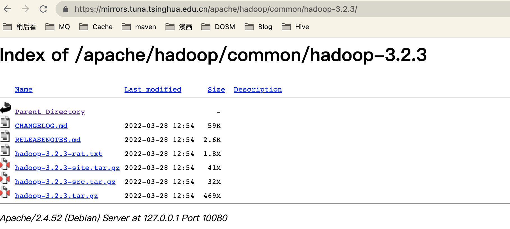

1.hadoop下载地址

https://hadoop.apache.org/release/3.2.3.html

https://mirrors.tuna.tsinghua.edu.cn/apache/



3.jdk下载地址

https://www.oracle.com/java/technologies/downloads/


4.下载后传输至服务器并解压

```shell
n@n:~/module$ tar -xzvf hadoop-3.2.3.tar.gz 
n@n:~/module$ tar -xzvf jdk-8u333-linux-x64.tar.gz
n@n:~/module$ mv jdk1.8.0_333/  jdk1.8
n@n:~/module$ pwd
/home/n/module
n@n:~/module$ ls -l
total 625256
drwxr-xr-x 9 n n      4096 Mar 20 09:58 hadoop-3.2.3
-rw-r--r-- 1 n n 492241961 Jul 13 14:59 hadoop-3.2.3.tar.gz
drwxr-xr-x 8 n n      4096 Apr 26 14:03 jdk1.8
-rw-r--r-- 1 n n 148003421 Jul 13 15:00 jdk-8u333-linux-x64.tar.gz
n@n:~/module$ 
```

5.添加环境变量

```shell
n@n:~$ vim .bash_profile
n@n:~$ source .bash_profile 
n@n:~$ 
....
export JAVA_HOME=/home/n/jdk1.8
export PATH=.:$JAVA_HOME/bin:$PATH
...
n@n:~$ 
n@n:~$ java -version
java version "1.8.0_333"
Java(TM) SE Runtime Environment (build 1.8.0_333-b02)
Java HotSpot(TM) 64-Bit Server VM (build 25.333-b02, mixed mode)
n@n:~$ pwd
/home/n

```

