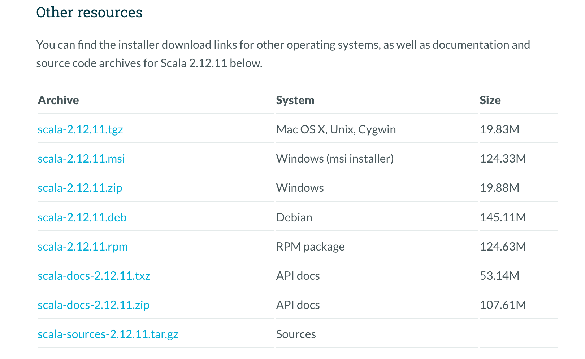

### Scala快速入门
#### 1、Scala下载地址
https://www.scala-lang.org/download/all.html
https://www.scala-lang.org/download/2.12.11.html

```shell
n@n:~/module$ wget https://downloads.lightbend.com/scala/2.12.11/scala-2.12.11.tgz
n@n:~/module$ tar -xzvf scala-2.12.11.tgz 

```
#### 2、添加环境变量
```shell
n@n:~/module/scala-2.12.11$ pwd
/home/n/module/scala-2.12.11
n@n:~/module/scala-2.12.11$ vim ~/.bash_profile 
export SCALA_HOME=/home/n/module/scala-2.12.11
export PATH=.:$SCALA_HOME/bin:$PATH
n@n:~/module/scala-2.12.11$ source ~/.bash_profile 
```
#### 3、环境验证
```shell
n@n:~/module/scala-2.12.11$ scala
Welcome to Scala 2.12.11 (Java HotSpot(TM) 64-Bit Server VM, Java 1.8.0_333).
Type in expressions for evaluation. Or try :help.

scala> 1+1
res0: Int = 2

scala> res0
res1: Int = 2

scala> res0+2
res2: Int = 4

scala> 
```
#### 4、Scala基础语法
>##### 常量变量
```shell
scala> val a=1
a: Int = 1

scala> var b=1
b: Int = 1

scala> val c: Int = 3
c: Int = 3

scala> 1 to 10
res0: scala.collection.immutable.Range.Inclusive = Range 1 to 10

scala> 1.toString()
res1: String = 1

scala> var count=1
count: Int = 1

scala> count++
<console>:13: error: value ++ is not a member of Int
       count++
            ^

scala> count+=1

scala> count
res4: Int = 2

scala> :paste
// Entering paste mode (ctrl-D to finish)

val i = 10
for (j <- 1 to i)
print(j)

// Exiting paste mode, now interpreting.

12345678910i: Int = 10

scala> 

scala> :paste
// Entering paste mode (ctrl-D to finish)

val i = 10
for(j <- 1 until 10)
print(j)

// Exiting paste mode, now interpreting.

123456789i: Int = 10

scala> 

scala> for(c<-"hello Scala") println(c)
h
e
l
l
o
 
S
c
a
l
a


```
>##### Set
```shell
scala> val s=Set(1,2,3)
s: scala.collection.immutable.Set[Int] = Set(1, 2, 3)

scala> s + 4
res11: scala.collection.immutable.Set[Int] = Set(1, 2, 3, 4)

scala> s += 4
<console>:13: error: value += is not a member of scala.collection.immutable.Set[Int]
  Expression does not convert to assignment because receiver is not assignable.
       s += 4
         ^

scala>  val s = scala.collection.mutable.Set(1,2,3)
s: scala.collection.mutable.Set[Int] = Set(1, 2, 3)

scala> s += 4
res13: s.type = Set(1, 2, 3, 4)

scala> 
```
>##### List
```shell
scala> 

scala> val l=List(1,2,3,4)
l: List[Int] = List(1, 2, 3, 4)

scala> l.tail
res14: List[Int] = List(2, 3, 4)

scala> l.head
res15: Int = 1

scala>  l.head :: l.tail
res16: List[Int] = List(1, 2, 3, 4)

scala> for(i<- l) println(i)
1
2
3
4
```

```shell

```