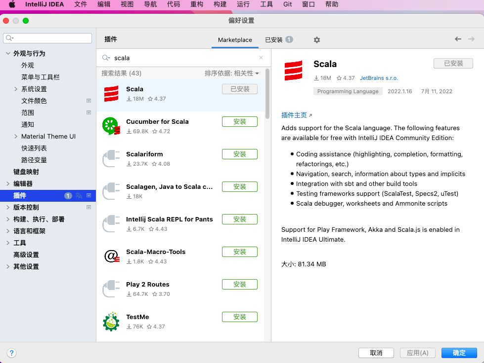

### 使用idea开发Scala
#### 1、安装scala插件

#### 2、


```scala
object ScalaObjectDemo {

  def main(args: Array[String]): Unit = {
    println("Hello Scala")
  }
}

```

scala中接口使用trait而不是iterface
scala中不支持类的多继承
scala支持对trait进行多重继承,需要使用with完成多重继承
scala对类和接口的继承都使用extends